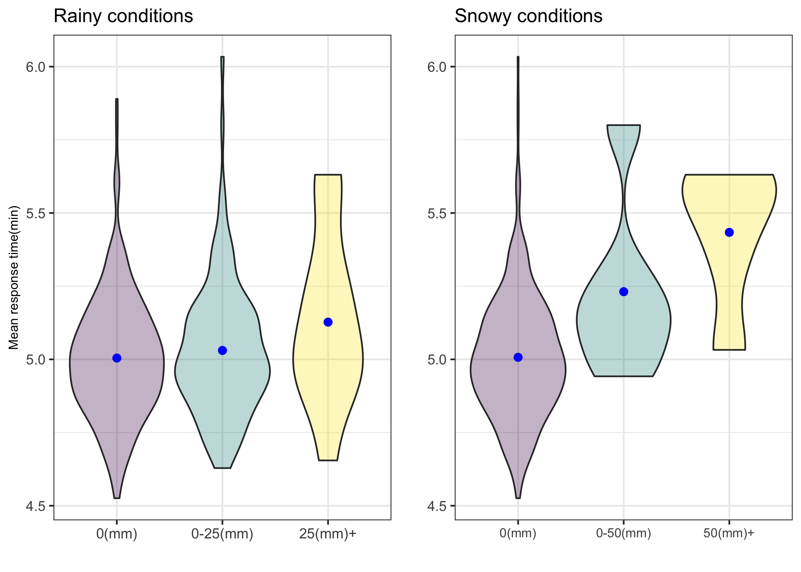
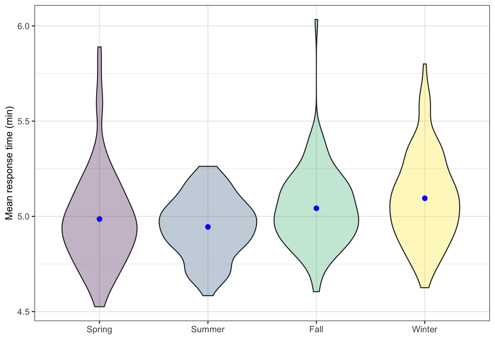
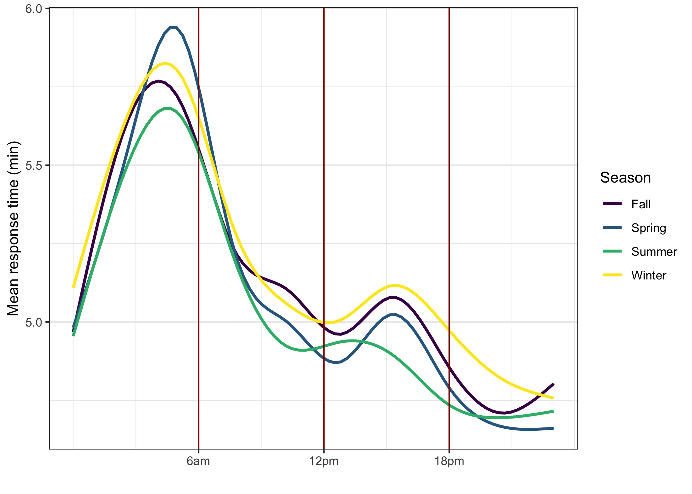

In order to figure out the association between response time and each explanatory variables, exploratory data analysis was performed.

### Weather

Both precipitation and snow are categorized into three categories according to the amount. It appears that precipitation is not correlated with response time but snow is.

### Season

Mean response time is slightly increased in winter, which may be explained along with snow variable.  

### Hour of the day

It seems that response is delayed peak around 5 am and getting improved. Based on this result, hour of the day will be categorized into dawn, morning, afternoon and night.   