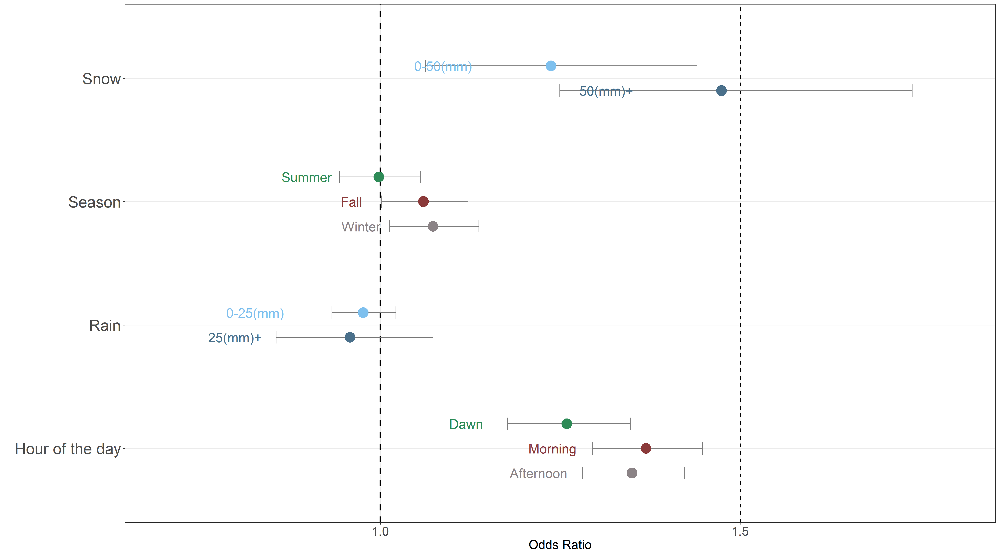
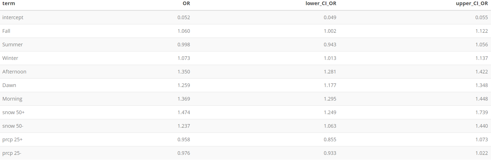
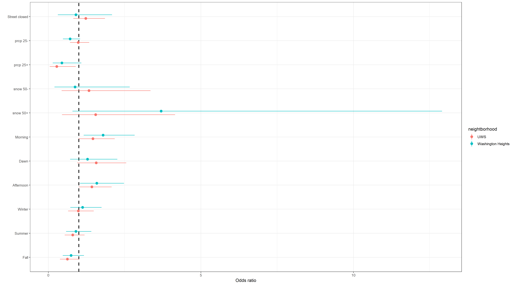

### Model

$$
\begin{aligned}
&logit(P(response\space time > 8 min))\\
&= \beta_{0} + \beta_{1}I(season = Fall) + \beta_{2}I(season = Summer) + \beta_{3}I(season = Winter) \\
& + \beta_{4}I(hour\space of \space day = afternoon) + \beta_{5}I(hour\space of \space day = dawn) + \beta_{6}I(hour\space of \space day = morning) \\
& + \beta_{7}I(snow = 50mm+) + \beta_{8}I(snow = 50mm-) + \beta_{9}I(prcp = 25mm+) + \beta_{10}I(prcp = 25mm-) 
\end{aligned}
$$

### Result

**Snow**
  As expected from EDA, compared to no snow conditions, odds of over 8min response time is increased 24% by 0~50mm snow and 47% by over 50mm snow.

**Season** 
  Compared to Spring, Summer does not affect odds of over 8min response time but odds is increased in Fall by 6% and in Winter by 7%. 

**Rain**
  Statistically significant result was not obtained from rain variable and it matches the result of EDA.

**Hour of the day**
  In reference to night, odds of over 8min response time is increased at dawn by 26%, in the morning by 37% and in the afternoon by 35%.

### Subset analysis
We fitted regression model by neighborhood and here is our findings:

* On Upper West Side, high precipitation is associated with lower odds of response times greater than 8 minutes. 
* Street closure is associated with the outcome but not statistically significant. Washington Heights, on the other hand, saw afternoon and dawn time, compared to the night time as reference, as contributing factors to the response time greater than 8 minutes with ORs 1.6 and 1.3, respectively. Again street closure is not predictive of the outcome. 
* The null result from street closure could be due to either linking street closure to the zip code in this case is too broad or street closure did not really play a role in our response time.
* The model with neighborhood as predictor variable tells us that Washington Heights had 1.05 times the odds of response time greater than 8 minutes compared to the Upper West Side. However the observed effect is not statistically significant. At least we can be rest assured whether where we live, we still receive equal treatment from the emergency dispatcher.

###Conclusions and future scope

* From our analysis, we found that New York City had satisfactory medical emergency response time(~5.5mins) overall in 2017. As expected, the response time increases when there's snow (winter) however precipitation doesn't affect it. To our pleseant surprise, street closure doesn't affect the response time as well. 
* On comparing response time in Upper West Side and Washington Heights specifically, there were some associations between street closure and precipitation. However, none were statistically significant.

__Future scope__ 

* Having established that the emergency response time is relatively satisfactory in New York City, this opens up questions about the qualifications of the emergency responders and what type of care providers at different levels are allowed to provide.

* Another area to explore would be to investiage if all the response vehicles have the necessary equipments to deal with any emergency situation to best increase survival rate.

